# Khaidai
> restaurant-management-system.
> **Yet to complete some functionalities. But stopped the development.**
---

## Features
* Cart
* Order confirmation
* Promo Token
* Login/Registration
* **Restaurants**
	* Profile
	* Food menu
	* Rating/reviews
* Search
* My Orders Dashboard
* Notifications
* Profile
* My Reviews
* Admin Order management dashboard **(Only for superuser)**
* etc...
---

## Used Technologies
* Python
* Django v1.11
* SQLite3
* HTML
* CSS
* Bootstrap
* ClockPicker
* Font-Awesome
* JavaScript
	* **jQuery**
		* Ajax
	* Notify.js
	* jQueryMyCart.js
	* Wow.js
---

# Installation

### Create khaidai's virtual environment & goto the directory.
**Linux**
```bash
virtualenv -p /usr/bin/python3 khaidai
cd khaidai/
```
**Windows**
```bash
virtualenv khaidai
cd .\khaidai\
```

### Activate virtualenv
**Linux**
```bash
source bin/activate
```
**Windows**
```bash
.\Scripts\activate
```

**clone the project in the khaidai directory.**
```bash
git clone https://github.com/iraihankabir/restaurant-management.git
```

### Install reequirements.txt
```bash
python -m pip install -r requirements.txt
```

### rename restaurant-manager directory to 'src' **[optional]**.
```bash
mv restaurant-manager src/
```

### goto src directory and create db models.
```bash
cd src/
python manage.py migrate
```

### Run dev server at port 8888.
```bash
python manage.py runserver 8888
```
* now goto http://127.0.0.1:8888/
---

# SCREENSHOTS

## 01
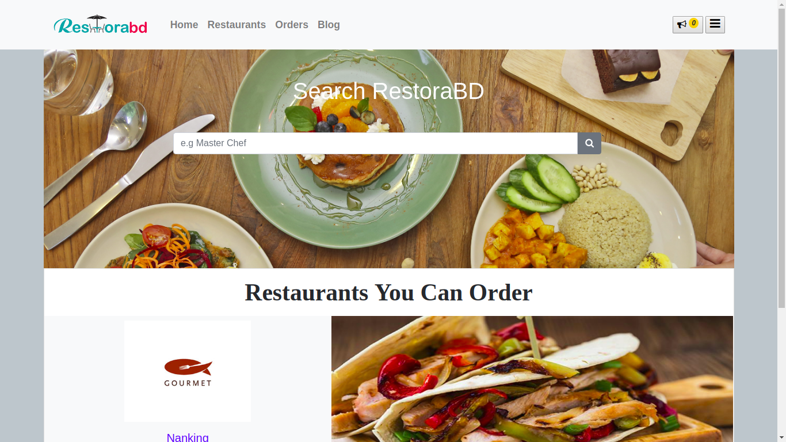
---

## 02
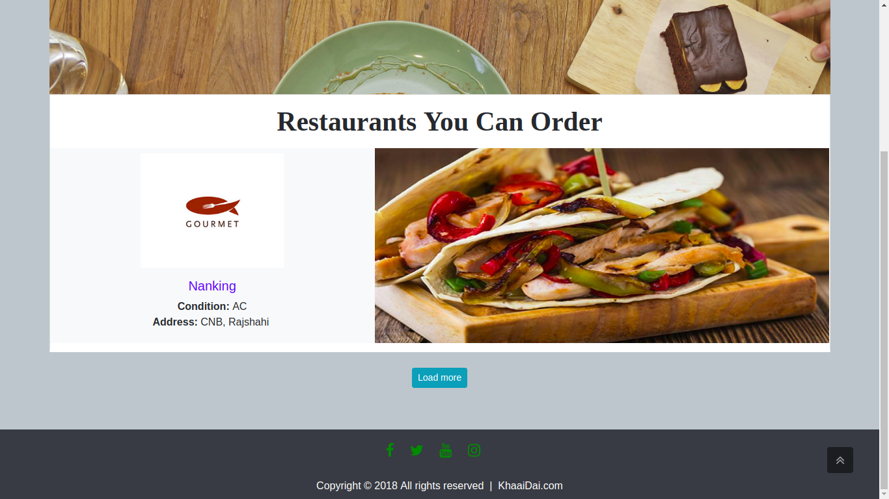
---

## 03
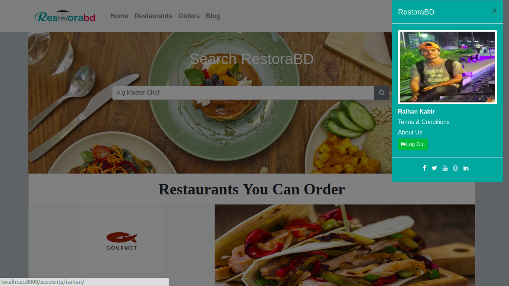
---

## 04
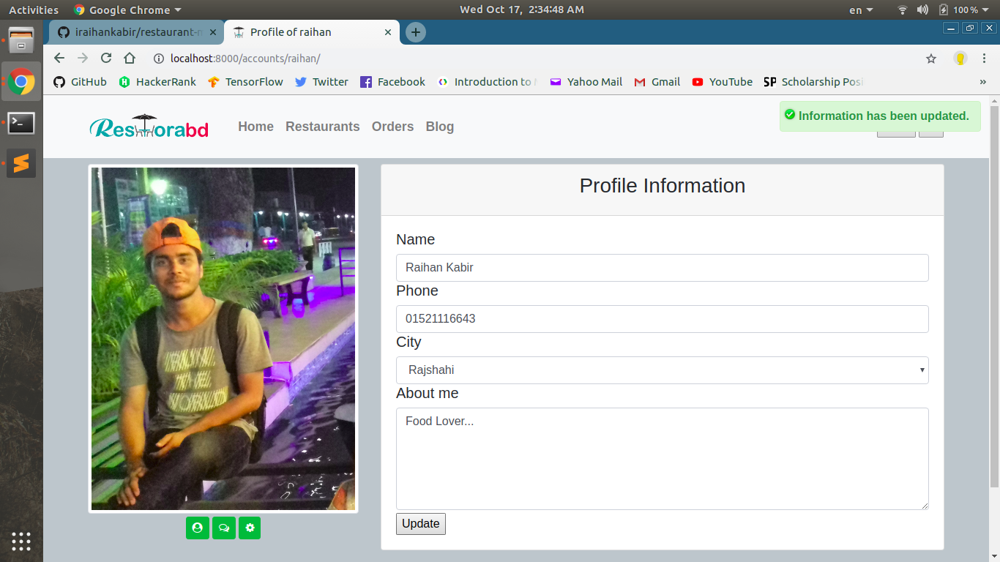
---

## 05
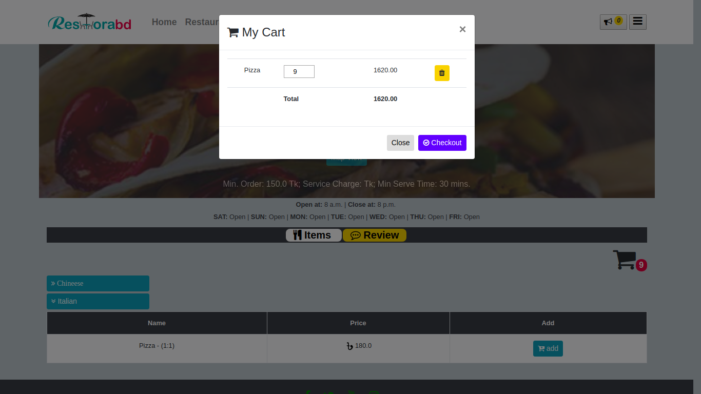
---

## 06
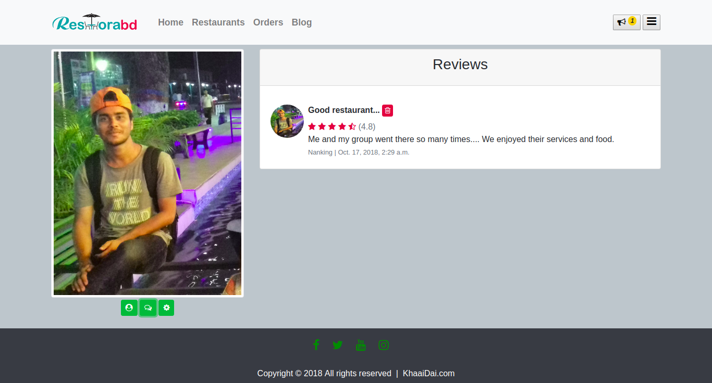
---

## 07
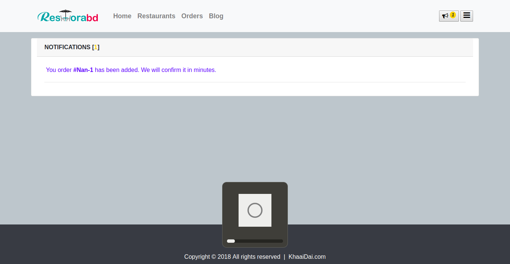
---

## 08

---

## 09
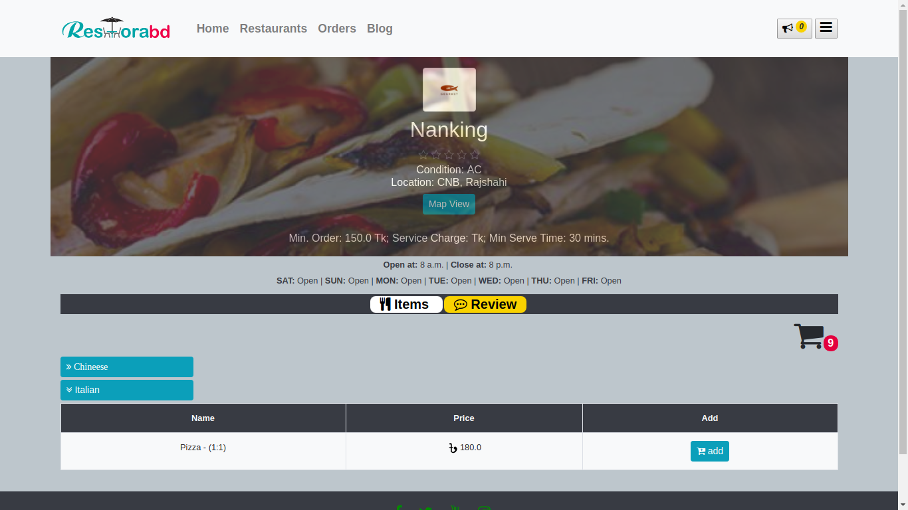
---

## 10

---

## 11
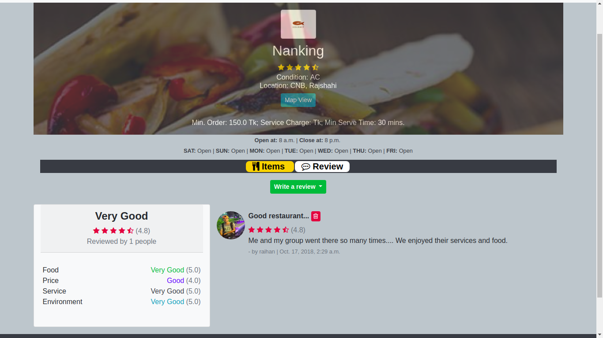
---

## 12
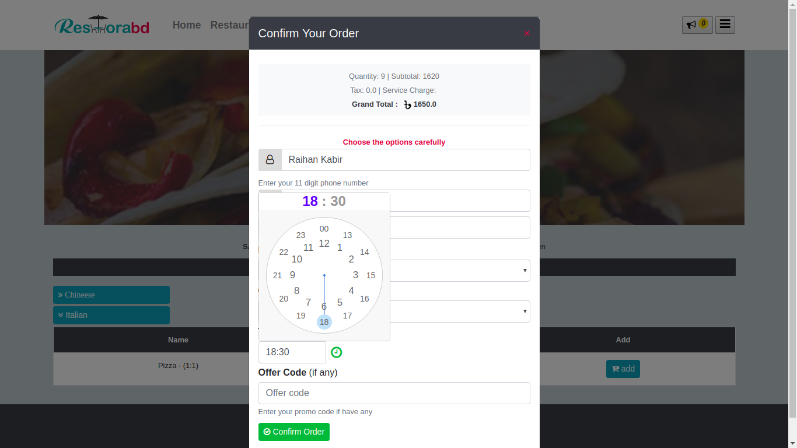
---

## 13
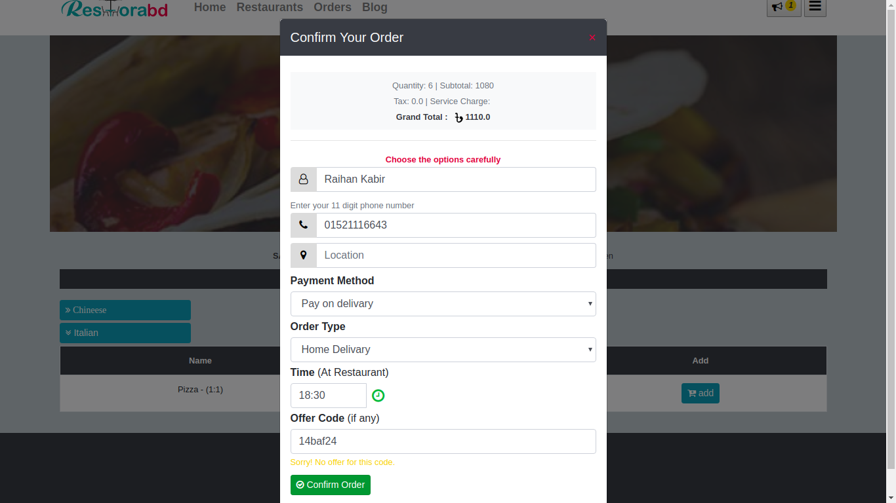
---

## 14
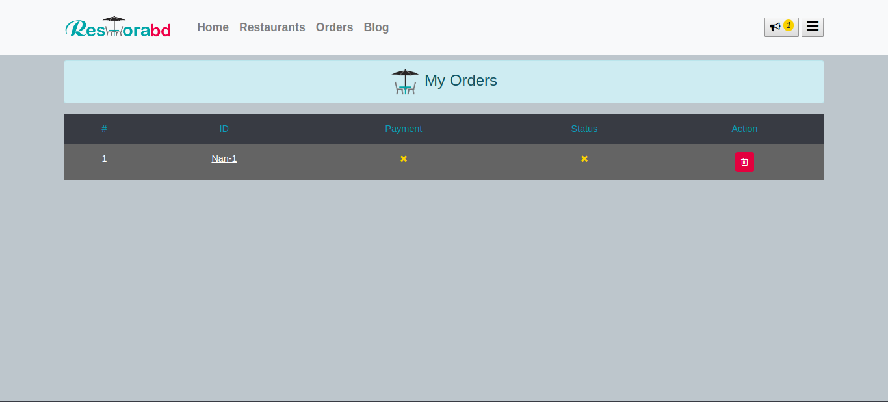
---

## 15
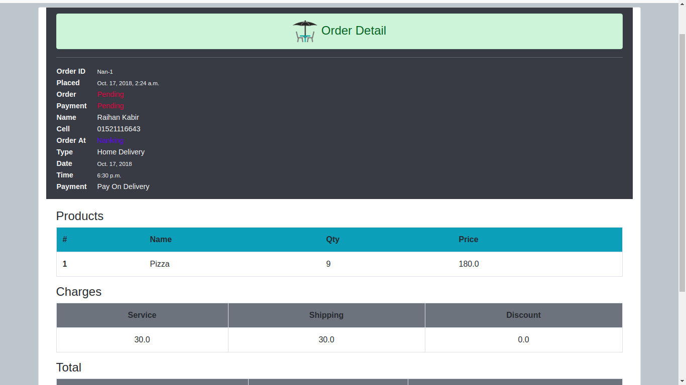
---

